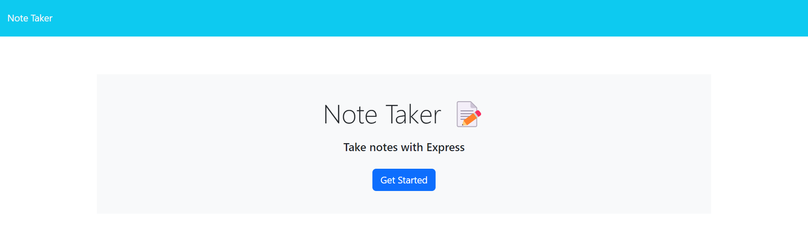
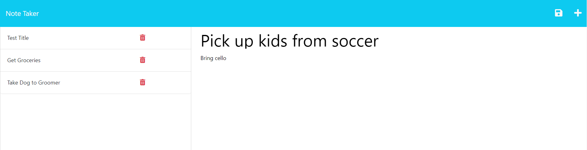
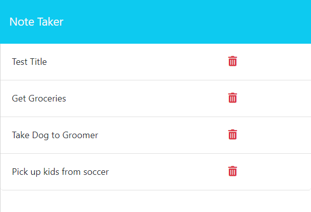

# note-taker

## Description
The [Note Taker](https://cleidy-note-taker.herokuapp.com/) application, hosted on Heroku to allow for full online diployment, can save notes and to-dos on the go. It was my first experience with Express and Heroku, setting the groundwork for more elaborate deployed applications going forward. Notes are stored relative to the application, not on a specific device, so you can take your notes with you no matter what device you're working from.

## Usage

The site will open with a homepage. Click the Get Started button to open the application. 

Any previously saved notes will show up on the left hand side of the application screen. Enter a note title and some text on the right hand side.

If you're happy with your note, click the save button (floppy disc icon) at the top right of the screen. This will save your note, and it will be added to the lefthand menu for future retrieval. 

If you want to start a brand new note, just click the + button at the top right, and you'll kick off a new blank note.
